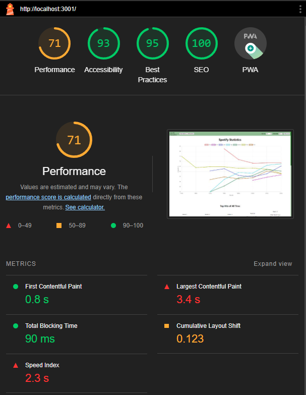
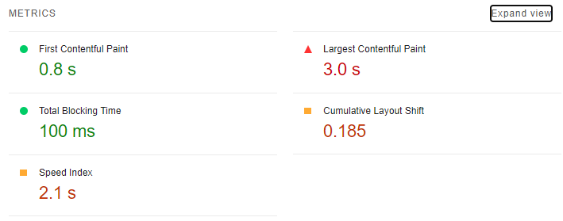

# Performance of Spotify Favourites

## Introduction and Methodology

Enviroment: Google Chrome (only because I could not get firefox lighthouse to work -- chrome sucks), Windows 11, 120.0 (64-bit) version, on a desktop computer, viewport 1920 x 1080

We first gathered preformance data using Lighthouse

The two biggest problem areas we see is the LCP, which is quite high at 3.4 second. Lighthouse says that the h1 for "Top Music of All time" is the LCP. The render delay is over 3 seconds, which makes sense, since this component only renders once the intial fetch of all the songs is completed from the API. This was a good place to start improving preformance. If we can limit the intial fetch time of the main window by reducing the amount of data we fetch from the API, we can imporve the LCP and general preformance of the website

Then, we took a look at whatdoesmysitecost.

Two clear areas of improvment here; Try to limit the amount of image requests on the intial load, since over 80% of all requests are image requests. The other category is worse

3000ms of render blocking fetching of 6000 plus songs from the DB. Improving there can lead to massive improvments

---

After improvments of whatdoesmysitecost go here

<!-- Briefly state how you gathered data about app performance, and in what environment 
(which browsers, what browser versions, what kind of device, OS,
width and height of viewport as reported in the console with `window.screen) -->

<!-- Also report overall impact on whatdoesmysitecost results before and after all your changes -->

## Areas to Improve

## Summary of Changes 

### Change 1 -- Fetch less feilds per song

Lead: Luca

Currently, the original fetch allSongs endpoint was returning all the data from the songs,
even though we only used a select number of fields (Genre, songname, artist etc.) to generate our main line graph

This could be causing the Largest Contentful Paint (LCP) of the intial page load to be longer
since we fetch extra data in the initial useEffect

### Before -- LCP is 3.0s

### After

### <!-- Change n -->

Lead: <!-- name main contributor to this change -->

## Conclusion

<!-- Summarize which changes had the greatest impact, note any surprising results and list 2-3 main 
things you learned from this experience. -->