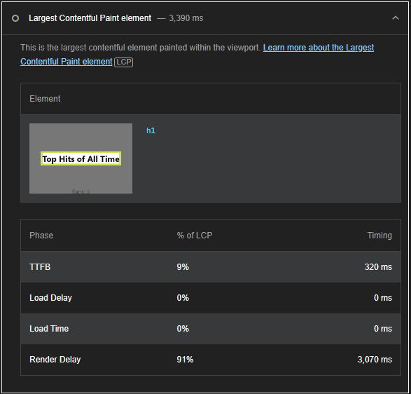
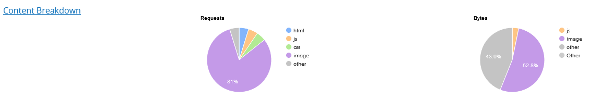
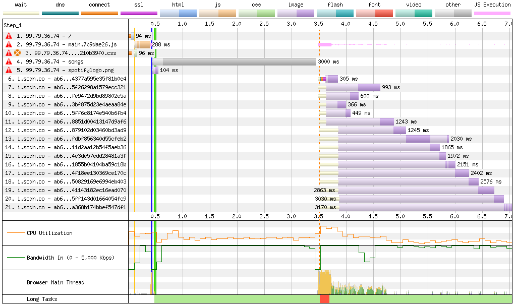
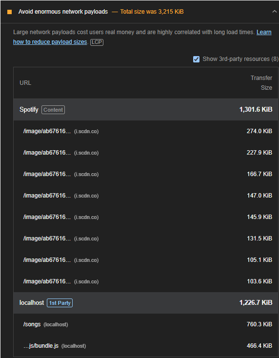
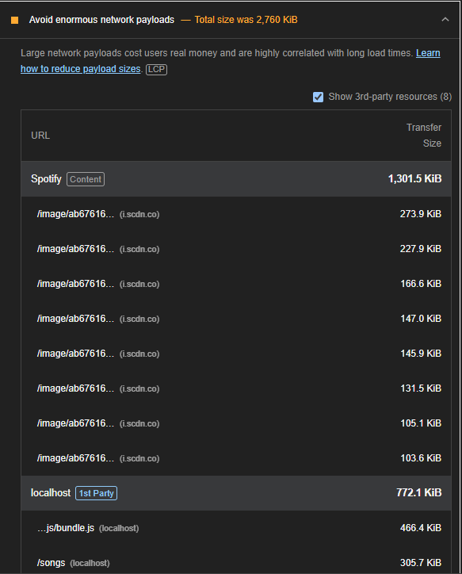

# Performance of Spotify Favourites

## Introduction and Methodology

Enviroment: Google Chrome (only because I could not get firefox lighthouse to work -- chrome sucks), Windows 11, 120.0 (64-bit) version, on a desktop computer, viewport 1920 x 1080

We first gathered preformance data using Lighthouse

The two biggest problem areas we see is the LCP, which is quite high at 3.4 second. Lighthouse says that the h1 for "Top Music of All time" is the LCP. The render delay is over 3 seconds, which makes sense, since this component only renders once the intial fetch of all the songs is completed from the API. This was a good place to start improving preformance. If we can limit the intial fetch time of the main window by reducing the amount of data we fetch from the API, we can imporve the speed and general preformance of the website

Then, we took a look at whatdoesmysitecost.

Two clear areas of improvment here; Try to limit the amount of image requests on the intial load, since over 80% of all requests are image requests. The other category is worse

3000ms of fetching from 6000 plus songs from the DB. Improving there can lead to massive improvments.

---

After improvments of whatdoesmysitecost go here

## Areas to Improve

## Summary of Changes 

### Change 1 -- Fetch less feilds per song

Lead: Luca

Currently, the original fetch allSongs endpoint was returning all the data from the songs,
even though we only used a select number of fields (Genre, songname, artist etc.) to generate our main line graph

This could be causing the intial page load to be longer since we fetch extra data in the initial useEffect which is render blocking. The faster we fetch data, the faster things will load. By reducing the size of the inital fetch, we can also decrease the size of the payload.

### Before -- /songs size is 760 kb

### After -- /songs size is 305 kb

* Note, these screenshots come from the development server and not the deployed build. Still, these changes would track in helping reduce file size in deployment.

This is a marked improvment, cutting the size of the of the payload in half. There was also a small improvment to the speed metric of lighthouse, going from 2.3s to around 2.0 - 1.9s. This once again made sense, since a smaller payload for the songs data means we can fetch it faster, and in turn display it in our chart.js line graph quicker.

### Change 2 -- Lazy loading album cover images that are below the fold

Lead: Luca

The album cover images are another source of potential performance improvment. The album cover images are not stored locally, but are each individually fetched by sending an individual get request to the Spotify API. We initially set the max number of songs to appear in the TopMusic section to be 20, which was an abritrary number, but those images are to close to the intial viewport so they are all fetched and loaded when on the intial load of the website. 

We could have gone about this in a couple ways. There was the idea of adding a padding to the bottom of the graph component to push the TopMusic component down enough to lazy load some of the images. This had the issue of only lazy loading the last 5 or so album image covers, which is not worth it considering it also made the website UI really segemented, ugly and bad. Another idea was to just have a button that onclick would load the images, but that again seemed to segment our UI too much, and it would not have the same flow that our current UI does, where you can just scroll past the graph to get a bunch of albums.

We decided that we could increase the number of songs to 50, since those lower ones would make use of lazy-loading, and would therefore not impact performance for the most part on the initial load.

### Change 3 -- Fetching the top songs of each genre

Lead: Luca

Initialy, the top songs for each genre and decade was being handled entirely on the client side. The components would take in the selected genre and decade, and do a sort/filter/split on all the initial fetched songs. 

Instead of doing 

## Conclusion

<!-- Summarize which changes had the greatest impact, note any surprising results and list 2-3 main 
things you learned from this experience. -->