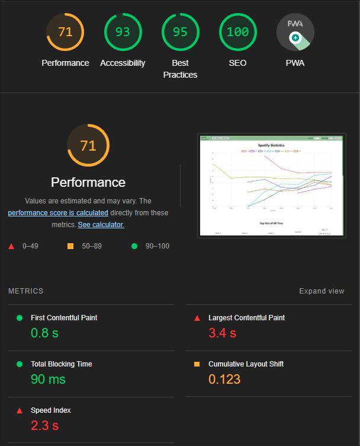

# Performance of Spotify Favourites

## Introduction and Methodology

Enviroment: Google Chrome (only because I could not get firefox lighthouse to work -- chrome sucks), Windows 11, 120.0 (64-bit) version, on a desktop computer, viewport 1920 x 1080

We first gathered preformance data using Lighthouse

The two biggest problem areas we see is the LCP, which is quite high at 3.4 second. Lighthouse says that the h1 for "Top Music of All time" is the LCP. The render delay is over 3 seconds, which makes sense, since this component only renders once the intial fetch of all the songs is completed from the API. This was a good place to start improving preformance. If we can limit the intial fetch time of the main window by reducing the amount of data we fetch from the API, we can imporve the speed and general preformance of the website

Then, we took a look at whatdoesmysitecost.

Two clear areas of improvment here; Try to limit the amount of image requests on the intial load, since over 80% of all requests are image requests. The other category is worse

3000ms of fetching from 6000 plus songs from the DB. Improving there can lead to massive improvments.

---

Once all the improvments were implmented, we ran Lighthouse again

We can see some improvments here right off the bat. The speed of the site has been cut in half, down to 1.2s. There is also a much faster largest contentful paint.

Whatdoesmysitecost

The cost of the site has statyed the same, but I don't think it tells the whole story. Since the original test, we've added a couple of static files to our website, namely the loading gif to try and stabalise the layout shift. Even with the new file additions, the site cost stayed the same, so it shows our improvements were still good in keeping the size of the website down.

The waterfall also shows how we were able to cut the size of the songs fetch in half, down to 1500ms, and the TopMusic fetch is only 54ms, meaning the change to using an API for fetching the top songs was a more efficient way to get the data compared to what we were doing before, filtering and slicing the entire songs data everytime the user changed the decade or genre in the navbar

## Areas to Improve

## Summary of Changes 

### Change 1 -- Fetch less feilds per song

Lead: Luca

Currently, the original fetch allSongs endpoint was returning all the data from the songs,
even though we only used a select number of fields (Genre, songname, artist etc.) to generate our main line graph

This could be causing the intial page load to be longer since we fetch extra data in the initial useEffect which is render blocking. The faster we fetch data, the faster things will load. By reducing the size of the inital fetch, we can also decrease the size of the payload.

### Before -- /songs size is 760 kb

### After -- /songs size is 305 kb

* Note, these screenshots come from the development server and not the deployed build. Still, these changes would track in helping reduce file size in deployment.

This is a marked improvment, cutting the size of the of the payload in half. There was also a small improvment to the speed metric of lighthouse, going from 2.3s to around 2.0 - 1.9s. This once again made sense, since a smaller payload for the songs data means we can fetch it faster, and in turn display it in our chart.js line graph quicker.

### Change 2 -- Lazy loading album cover images that are below the fold

Lead: Luca

The album cover images are another source of potential performance improvment. The album cover images are not stored locally, but are each individually fetched by sending an individual get request to the Spotify API. We initially set the max number of songs to appear in the TopMusic section to be 20, which was an abritrary number, but those images are to close to the intial viewport so they are all fetched and loaded when on the intial load of the website. 

We could have gone about this in a couple ways. There was the idea of adding a padding to the bottom of the graph component to push the TopMusic component down enough to lazy load some of the images. This had the issue of only lazy loading the last 5 or so album image covers, which is not worth it considering it also made the website UI really segemented, ugly and bad. Another idea was to just have a button that onclick would load the images, but that again seemed to segment our UI too much, and it would not have the same flow that our current UI does, where you can just scroll past the graph to get a bunch of albums.

We decided that we could increase the number of songs to 50, since those lower ones would make use of lazy-loading, and would therefore not impact performance for the most part on the initial load.

### Change 3 -- Fetching the top songs of each genre

Lead: Luca -- Adriano

Initialy, the top songs for each genre and decade was being handled entirely on the client side. The components would take in the selected genre and decade, and do a sort/filter/split on all the initial fetched songs. 

Instead of doing that, we can try to define an endpoint that can leverage a database ability to sort and search data faster than manual js methods.

We can see, the loading of the TopMusic component is no longer needs to wait for songs to fetch. This allows it to load much faster...

...but not without other issues. The TopMusic loading faster and usually BEFORE the graph causes a very large cumulative layout shift, and is jarring to the eyes to see all the data jump down when the graph is done loading. 

We could have a check to only display this components when the songs is done fetching, which would lower some of the benefit, but still be an improvment since the components will be ready to go the moment the graph is displayed. We did this by waiting for all the data to be fetched and ready to display before painting it to the screen

### Change 4 -- Caching

Lead: Adriano

Another pretty obvious area for improvment was to cache the data we were fetching from the db, so once we fetched the data for the first time, it would just load it directly instead of having to do a db fetch. This improved our loading speeds, as fetching songs became faster, and in turn, loading and displaying the main graph view also sped up

## Conclusion

The changes that had the greatest impact was the limiting of the amount of values we were fetching from the db using projections, aswell as using caching and a new seperate route for fetching the top songs. Really, they all seemed to make an impact beyond the lazy-loading which did not do too much for improving performance, aside from letting us include more data below the  fold without hampering our performance.

The results were not too surprising, most changes had the effects we expected. Using projections and loading less data allowed us to start displaying our components more quickly in the initial load, improving the speed of our app tremendously. The difference in the time it took to load the Graph before and after the changes were quite apparent

There was a lot to be learned from this experience. One, and what we felt was most valubale, was getting a better understanding of all the tools that are available in diagnosing and helping to visualize the perforamance of web apps and how to improve them. Lighthouse gives a lot of suggestions on what can be improved, including relevant links explaining how we could go about doing it. The waterfall visualization is also super helpful in showing what might be causing render blocking, and what specific fetches are taking the longest and the order of which they are happening. With all these tools, it was pretty easy to figure what can be improved, and actually be able to check what HAD improved.

The other main takeaway is that not all performance improvements are simple 100% improvements. Sometimes, imporvments can come with side-effects. Fetching some pieces of data in parralel to one another can have some unintended side effecs. Like how fetching the top music in a seperate fetch call caused us to have to rethink how we intially displayed our home page to avoid huge content shifts that werent there when we were fetching the songs first and then getting the top songs. 

Sometimes improvements are not always possible, and that you have to have bigger fetches or loading times as a limitation of the data you are using and what you are trying to do with it. Try as we might, there was no easy way to display the data we wanted to show without fetching all the songs in the db, so we had to find ways to make that initial fetch to be as fast as possible.

<!-- Summarize which changes had the greatest impact, note any surprising results and list 2-3 main 
things you learned from this experience. -->