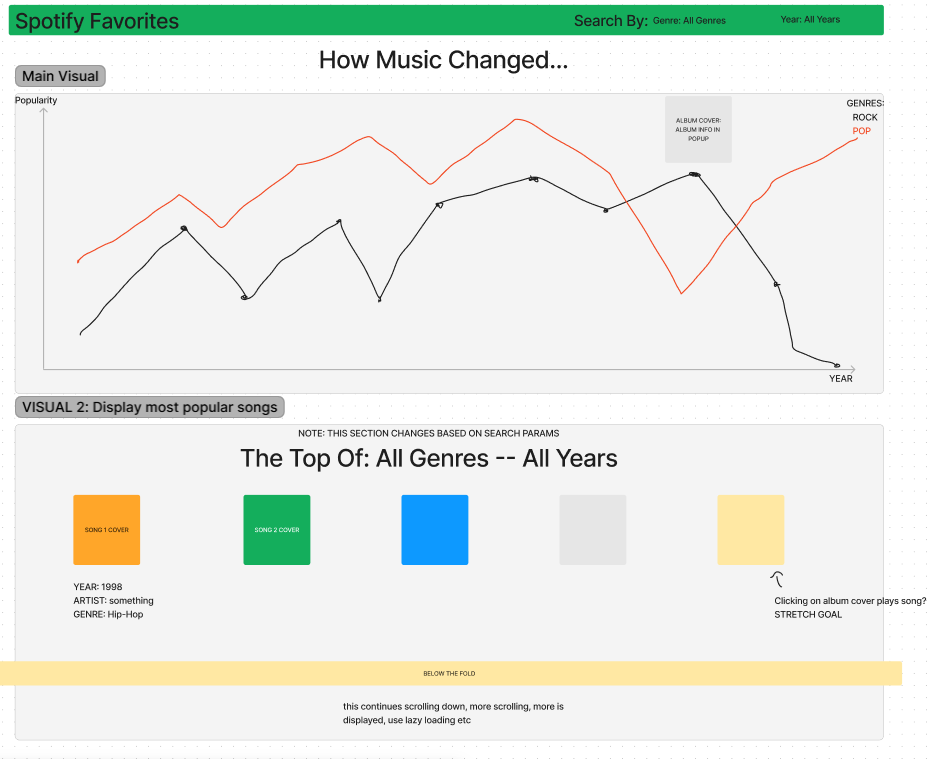

# Spotify Favourites

## Data
Link to issue(https://gitlab.com/csy3dawson23-24/520/teams/TeamL22-AdrianoLuca/520-project-dalonzo-fratipietro/-/issues/4)

### Summary
This project uses Spotify playlist data to track the genres, names and other 
qualities of the most popular songs of the last 60 years. Using this data, out application will visualize the changes in popular music over the last half century, showing the rise of new genres, and also how the quality of popular music has changed (tempo, wordiness, etc.) 

## API

### Endpoint /all-songs/year?genre

The first endpoint we will define will fetch all the songs in our data from a specific year. If the client does not request a specific genre to be given, all songs from that year will be in the response. If a specific genre query is passed, say Rock, all Rock songs for that year will be the response.

### Endpoint /most-popular/year

This endpoint will return the 10 most popular songs of a given year defined by the Data's "Popularity" value. Optionally, allow query parameter to return different amounts of songs

### Endpoint /all-songs

Simply returns all-songs in the dataset

### Endpoint /highest-tempo/number

This endpoint is more of a stretch goal, can return the highest tempo songs of a given genre or maybe year. Could be interesting for a recap of a year type page on our application.

## Visualizations

The main visualization will be a line chart, with the x-axis being the year, the y-axis being the relative popularity (we can compute this say by a percentage of a genres songs in the data for a given year, or maybe leverage the popularity value in the data). Each line in the graph can represent a different genre, and as the years progress, we can show how the popularities of genres evolve throughout time.

Another visualization we can have is since the data set includes links to album covers for each song, we can display the top 10 songs of a given year in the client. If the user speicies they want to see the top 10 pop songs in 1984, we can display them using those image links in the data.

## Views

Above the fold: The header, the main visualization line graph, as well as the first 5 songs in the most popular song section

Below the fold: As the user scrolls down the most popular songs list, fetch the next batch of songs incrementally, and lazy load images if they are not initally in the viewport

## Functionality

The user could be able to specify a more detailed view of a certain genre in an input field at the top of the screen. This would reload the line graph to only contain the line for that specific genre, and update the top 10 songs to only include songs from that genre.

The user can also click on a point on the line graph to have a small popout with the most popular song of that year, and it could link to a google search for that song (maybe potentially play a snippet of the song, would need to see about that)

## Features and Priorities

### Core Features

The large line graph visualization with the popularity of certain songs/genres over the last 50 years

The top 10 songs for a given year, visualize them with album covers

Ability to specify a genre in more detail, showing more specific data about that genre -- including changes in the wordiness and tempo, aswell as the top song for that genre in for each year

### On the cutting board

The ability to play snippets of a song by clicking on the album cover popout -- this depends if spotify has an api for this, would be something to try to implement if we are satisified with the core functionality

## Dependencies

### Chart.js

Link to GitHub: https://github.com/chartjs/Chart.js

The line graph functionality with Chart.js allows for a lot of customization when it comes to line styling, and displaying data cleanly. The dependency is also open-source, is noted to work with React, and has comprehensive documentation, allowing us to more easily troubleshoot any issues we may have.